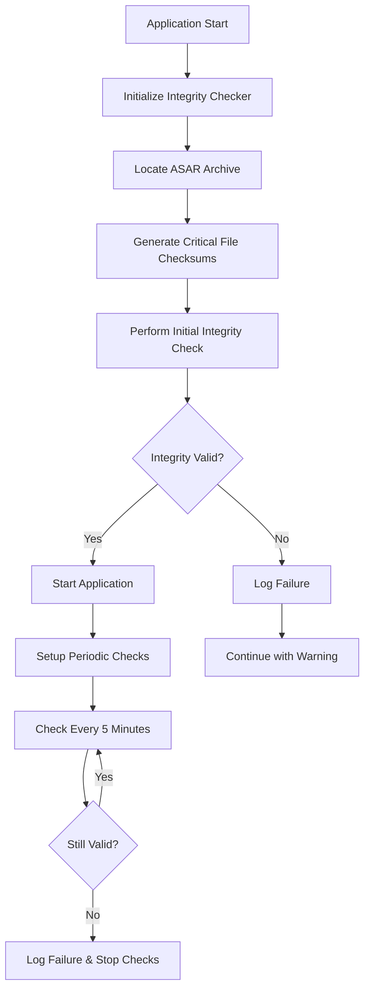

# Security Features Documentation

This document outlines the security features implemented in the Advanced Panorama Viewer application to protect against code tampering and reverse engineering.

## 🔒 Enhanced Code Obfuscation

### Overview
The application uses advanced JavaScript obfuscation techniques beyond standard webpack minification to protect the source code from reverse engineering.

### Implementation
- **Tool**: `javascript-obfuscator` with `webpack-obfuscator` plugin
- **Configuration**: `config/obfuscation.config.js`
- **Integration**: Webpack configuration in `next.config.js`

### Features
- **Variable Name Mangling**: All variable and function names are replaced with short, meaningless identifiers
- **String Array Encoding**: String literals are encoded and stored in arrays
- **Dead Code Injection**: Fake code blocks are inserted to confuse analysis tools
- **Control Flow Flattening**: Code execution flow is obfuscated
- **Self-Defending**: Code includes anti-debugging and anti-tampering measures

### Environment-Specific Settings

#### Development Mode
```javascript
{
  compact: false,
  controlFlowFlattening: false,
  deadCodeInjection: false,
  debugProtection: false,
  stringArray: false
}
```

#### Production Mode
```javascript
{
  compact: true,
  controlFlowFlattening: true,
  controlFlowFlatteningThreshold: 0.75,
  deadCodeInjection: true,
  deadCodeInjectionThreshold: 0.4,
  debugProtection: true,
  debugProtectionInterval: 2000,
  disableConsoleOutput: true,
  stringArray: true,
  stringArrayThreshold: 0.75,
  transformObjectKeys: true,
  unicodeEscapeSequence: false
}
```

### File Exclusions
The following files are excluded from obfuscation to prevent runtime issues:
- `node_modules/**/*`
- `**/webpack/**/*`
- `**/service-worker.js`
- `**/pdf.worker.js`
- Server-side code (when `target: 'node'`)

## 🛡️ ASAR Integrity Protection

### Overview
The ASAR integrity protection system verifies that the application's packaged code hasn't been tampered with during runtime.

### Implementation
- **Module**: `desktop/asar-integrity.js`
- **Integration**: Main Electron process (`desktop/main.js`)
- **Algorithm**: SHA-256 checksums

### Features

#### 1. Critical File Validation
- Monitors essential files: `main.js`, `preload.js`, `server-manager.js`
- Calculates and verifies SHA-256 checksums
- Detects unauthorized modifications

#### 2. ASAR Archive Verification
- Locates and validates the main ASAR archive
- Calculates archive-level checksums
- Ensures archive integrity

#### 3. Runtime Monitoring
- **Initial Check**: Performed during application startup
- **Periodic Checks**: Every 5 minutes in production mode
- **Development Mode**: Checks are skipped for development convenience

#### 4. Failure Handling
- Logs integrity failures to `userData/integrity-failure.log`
- Records detailed failure information including:
  - Timestamp
  - Failed files
  - Error details
  - System information
- Configurable response to integrity failures

### Security Workflow



## 🔐 IPC Security Enhancements

### Sender Validation
All IPC (Inter-Process Communication) requests are validated to ensure they originate from authorized renderers:

- **Main Window Validation**: Verifies requests come from the main application window
- **URL Validation**: Checks sender URLs against allowed patterns:
  - `http://localhost:*` (development)
  - `file://*` (production)
  - `app://*` (custom protocol)

### Parameter Validation
- **Path Name Restrictions**: Only allows specific path names (`userData`, `documents`, `downloads`, `temp`)
- **Input Sanitization**: Validates all IPC parameters before processing
- **Error Handling**: Logs unauthorized requests and throws appropriate errors

## 🧪 Security Testing

### Test Script
Run the security test suite to verify all protection features:

```bash
npm run test:security
```

### Test Coverage

#### 1. Obfuscation Tests
- ✅ Minified variable names
- ✅ Absence of readable function names
- ✅ Compressed syntax patterns
- ✅ Removal of debug statements
- ✅ Self-executing function patterns

#### 2. Integrity Protection Tests
- ✅ AsarIntegrityChecker class presence
- ✅ Checksum calculation functionality
- ✅ Critical files validation
- ✅ Integrity check methods
- ✅ Failure handling mechanisms
- ✅ ASAR path detection
- ✅ Production mode checks
- ✅ Error logging capabilities

#### 3. Configuration Tests
- ✅ Production obfuscation settings
- ✅ Development mode configurations
- ✅ File exclusion patterns
- ✅ Security option validation
- ✅ Next.js integration

## 📋 Build Process Integration

### Security-Enhanced Build Commands

```bash
# Standard build with security features
npm run build

# Electron build with integrity protection
npm run desktop:build:unpack

# Security validation
npm run test:security
```

### Build Process Flow

1. **Code Obfuscation**: Applied during webpack compilation
2. **ASAR Packaging**: Code is packaged into integrity-protected archive
3. **Integrity Setup**: Critical file checksums are calculated
4. **Security Validation**: Automated tests verify protection features

## 🚨 Security Considerations

### Limitations
- **Development Mode**: Security features are disabled for development convenience
- **Source Maps**: Should be disabled in production to prevent code analysis
- **Network Security**: Additional HTTPS and certificate pinning recommended for network communications

### Best Practices
- **Regular Updates**: Keep obfuscation tools and dependencies updated
- **Code Signing**: Implement proper code signing for distribution
- **Environment Variables**: Store sensitive configuration in environment variables
- **Monitoring**: Implement logging and monitoring for security events

### Customization Options

#### Obfuscation Levels
Adjust obfuscation intensity in `config/obfuscation.config.js`:
- **Light**: Basic minification and variable mangling
- **Medium**: Standard obfuscation with string arrays
- **Heavy**: Maximum protection with all features enabled

#### Integrity Response
Customize integrity failure handling in `desktop/asar-integrity.js`:
- **Log Only**: Record failures but continue execution
- **Warning Dialog**: Show user warning about potential tampering
- **Exit Application**: Terminate application on integrity failure
- **Remote Reporting**: Send failure reports to monitoring service

## 📚 References

- [JavaScript Obfuscator Documentation](https://github.com/javascript-obfuscator/javascript-obfuscator)
- [Electron Security Best Practices](https://www.electronjs.org/docs/tutorial/security)
- [ASAR Archive Format](https://github.com/electron/asar)
- [Node.js Crypto Module](https://nodejs.org/api/crypto.html)

---

**Note**: This security implementation provides protection against casual reverse engineering and tampering. For applications requiring higher security levels, consider additional measures such as server-side validation, hardware security modules, or professional security audits.